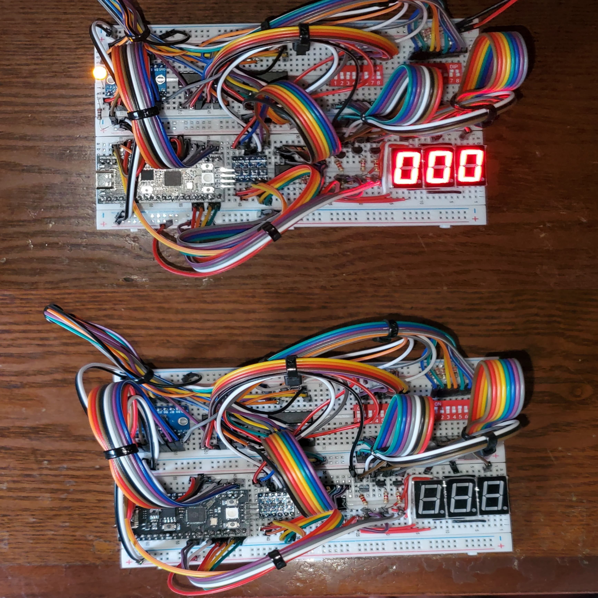
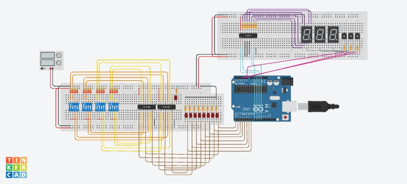

# 8-bit ALU Implementation in IoT



## Overview
This project demonstrates the design and implementation of an 8-bit Arithmetic Logic Unit (ALU) using various IoT components. The ALU adds two 8-bit binary values and displays the result on seven-segment displays. The main components include DIP switches, SN74LS83N Adder ICs, logic level shifters, a Raspberry Pi Pico, and seven-segment displays.

## Table of Contents
- [Features](#features)
- [Components](#components)
- [Hardware Design](#hardware-design)
- [Software Design](#software-design)
- [Circuit Diagram](#circuit-diagram)
- [Setup Instructions](#setup-instructions)
- [Usage](#usage)
- [Acknowledgments](#acknowledgments)
- [Additional Files](#additional-files)
- [License](#license)
- [Contact](#connect-with-me)

## Features
- **Addition of Two 8-bit Binary Numbers:** Inputs are provided via DIP switches.
- **Real-Time Display:** Results are shown on three seven-segment displays.
- **Embedded Control:** Raspberry Pi Pico processes input and controls the display.
- **Voltage Level Shifting:** Ensures compatibility between different components.

## Components
### Hardware
- DIP switches
- SN74LS83N Adder ICs
- Logic level shifters
- Raspberry Pi Pico
- Seven-segment displays
- Seven-segment decoder
- NPN transistors
- Resistors
- LEDs

### Software
- Python for programming the Raspberry Pi Pico

## Hardware Design
1. **Schematic Design**: Designed the circuit diagram using [Tinkercad](https://www.tinkercad.com/things/0uAzScpMNXA).
2. **Input Handling**: Used pull-down resistors with DIP switches for stable input signals and connected two 4-bit adder ICs to form an 8-bit adder.
3. **Voltage Level Shifting**: Converted the 8-bit output from the adder ICs (5V) to 3.3V using logic level shifters.
4. **Data Processing and Display**: Connected the output to the Raspberry Pi Pico, wrote a Python program to convert the 8-bit binary output to BCD, and controlled the seven-segment displays using NPN transistors.



## Software Design
- **Programming**: Python code was used to read the 8-bit binary input, convert it to BCD, and control the seven-segment display.
- **Control Mechanism**: Utilized three control pins to manage the display of three seven-segment displays by turning them on/off through NPN transistors.

## Circuit Diagram
The detailed circuit diagram is provided in the `ALU Diagram.pdf` file.

## Setup Instructions
### Hardware Setup
1. Connect the DIP switches, adder ICs, level shifters, seven-segment displays, decoder, transistors, resistors, and LEDs as per the circuit diagram.
2. Ensure all connections are secure and components are correctly oriented.

### Software Setup
1. Clone the repository and upload the provided Python code to the Raspberry Pi Pico.

```bash
git clone https://github.com/sithulaka/8-bit-ALU-Implementation.git
cd 8-bit-ALU-Implementation
```

2. Connect your Raspberry Pi Pico to your computer.
3. Upload the `alu.py` script to the Raspberry Pi Pico.

## Usage
1. **Input**: Use the DIP switches to input two 8-bit binary numbers.
2. **Output**: The sum of the input numbers will be displayed on the seven-segment displays.

## Acknowledgments
Special thanks to [Mr.Kavinda Madhubhashana](https://www.linkedin.com/in/kavinda-madhubhashana-8852b5234/) for their invaluable technical advice and support throughout this project.

## Additional Files
- **`alu.py`**: Python code for the Raspberry Pi Pico.
- **`ALU Diagram.pdf`**: Detailed circuit diagram.
- **`components.csv`**: CSV file listing all the components used.

## License
This project is licensed under the MIT License. See the [LICENSE](LICENSE) file for details.

## Connect with me
<p align="left">
<a href="https://linkedin.com/in/sithulaka" target="blank"></a>
<a href="https://twitter.com/sithulaka" target="blank"></a>
<a href="https://fb.com/senithu.sithulaka.7" target="blank"></a>
<a href="https://instagram.com/_sithulaka_" target="blank"></a>
<!-- <a href="https://discord.gg/ugdvth5b6H" target="blank"></a> -->
</p><br>
